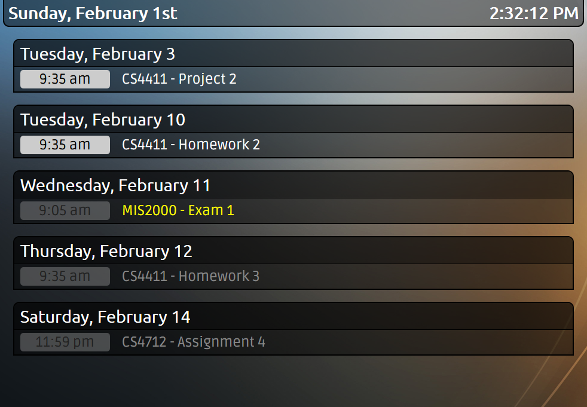

# NOTE - Abandoned project

This is a project I wrote in college to help me keep track of homework assignments. That was over a decade agao now. I no longer want to commit time to updating this project. If you find this project to be valuable to you, please feel free to fork it, adhering to the terms outlined in `LICENSE`.

I will no longer offer support for this project.

# ICS Calendar Display

The goal of this software is to create a customizable 10-foot style user
interface to display the contents of one or more iCal files.

The calendar has the ability to highlight or darken certain
events or calendars, and which events are displayed is customizable. Refer to the _Configuration_ section for more details.

# Requirements
This software utilizes AJAX to load the output of a PHP script. For security reasons, browsers will not allow AJAX
requests across domains, or from a local file. Because of this, you will need to either serve the display on the same domain as the rest of the software or configure CORS appropriately on your server.

PHP 5.3.9 or higher is required on the server to run this software.

[Composer](https://getcomposer.org/) is required to install necessary
development dependencies, but not required when using a prepackaged
release.

# Getting Started

1. Download the [latest release](https://github.com/BrandonDusseau/ics-display/releases/latest).
2. Drop this directory onto your web server.
3. Follow the configuration instructions below.

# Configuration
This repository contains an example configuration file, `config.example.php`.
This file must be renamed to `config.php` in order to be read properly.

The software provides the following options:

_Events_
- `$number_of_events` - Set to the maximum total number of events to display.
    Set this to `-1` for no limit.
- `$days_back` - Set to the number of days in the past to display events.
    Set this to `-1` for no limit.
- `$days_forward` - Set to the number of days in the future (including today) to
    display events. Set this to `-1` for no limit
- `$skip_keyword` - Any event with this string located anywhere in its
    description will not be displayed. To use no string, use `false`.

_Time Zone_
- `$timezone_override` - If you are unable to modify your PHP instance's configured
    time zone, you can use this option to set the time zone events are displayed in,
    e.g. `"America/Detroit"`. Set to `false` to disable.

_Highlight/Darken_
- `$highlight_today` - Set to `true` to highlight events that occur today. Set
    to `false` otherwise.
- `$highlight_calendars` - Add each calendar you wish to always highlight. For
    example, use `array("cal1", "cal2")` to highlight calendar sources named
    "cal1" and "cal2". To highlight no calendars, use `false`.
- `$highlight_keyword` - Any event with this string located anywhere in its
    description will be highlighted. To use no string, use `false`.
- `$darken_past` - Set to `true` to darken events that have passed. Set
    to `false` otherwise.
- `$darken_calendars` - Same as `$highlight_calendars`, except darkened.
- `$darken_keyword` - Same as `$highlight_keyword`, except darkened.

_Error Reporting_
- `$show_ical_errors` - Setting this to `true` will display an error if one or
    more iCal sources cannot be read or parsed. Set to `false` to suppress this
    message.

_Reload time_
- By default, data is reloaded from the ICS files every 60 seconds. This is set in the `interval` variable within the `calendar.js` file. Please note that this interval should not
    be set too low, as calendar reloads are relatively expensive.

_Styles_
- The background image is `bg.jpg` and can be replaced by any image. By default,
    the background will tile in both directions. Other styles can be modified in
    the `style.css` file.

# Attributions
This project relies on the [ics-parser library](https://github.com/u01jmg3/ics-parser/).
